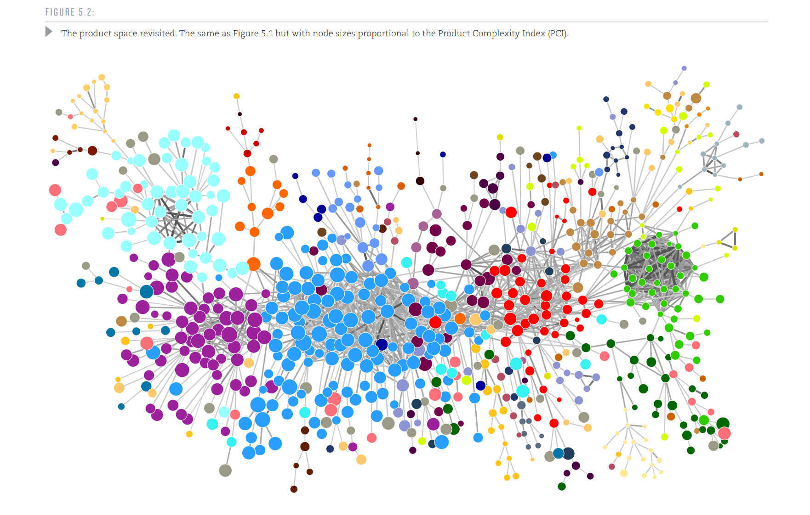

Trade and patents: RCAs, proximities, product space and economic complexity in R
================================================================================


4 February 2022, Matte Hartog (matte \_ hartog@hks.harvard.edu)


## Notes


Google colab link Python:

[https://colab.research.google.com/github/matteha/product-space-eci-workshop/blob/main/product-space-eci-workshop.ipynb](https://colab.research.google.com/github/matteha/product-space-eci-workshop/blob/main/product-space-eci-workshop.ipynb)

Google colab link in R:
[https://colab.research.google.com/github/matteha/product-space-eci-workshop/blob/main/product-space-eci-workshop-in-R.ipynb](https://colab.research.google.com/github/matteha/product-space-eci-workshop/blob/main/product-space-eci-workshop-in-R.ipynb)

To run code in Google Colab, you need a Google account.


## To do first


In Google Colab:

1.  Turn on Table of Contents: (in browser, click on &rsquo;View&rsquo; in top, then &rsquo;Table of Contents&rsquo;)

2.  Expand all sections (&rsquo;View&rsquo; > &rsquo;Expand Sections&rsquo; if not greyed out)


## Outline of lab session


Google Colab gives you access to a Jupyter Notebook but with an R kernel instead of a Python kernel, see:

[https://github.com/IRkernel/IRkernel](https://github.com/IRkernel/IRkernel)

We&rsquo;ll cover:

-   Introduction to trade data

-   Calculating RCAs, co-occurences and proximities
    -   Product and technology proximities
    -   Trade: specialization of countries over time
    -   Technologies (patents): specialization of countries and US cities over time

-   Using Python libraries in R: Product space visualization

-   Calculating Product Complexity / Economic Complexity (by destination)


## Trade data


### Background


The product space is, as well as its derivations / related measures such as economic complexity and the Growth&rsquo;s annual rankings of countries by economic complexity (at [https://atlas.cid.harvard.edu](https://atlas.cid.harvard.edu)), are based on trade data between countries.

The Growth Lab maintains and periodically updates a cleaned version of trade data at Harvard Dataverse:

[https://dataverse.harvard.edu/dataverse/atlas](https://dataverse.harvard.edu/dataverse/atlas)

This dataset contains bilateral trade data among 235 countries and territories in thousands of different products categories (a description of the data can be found at: [http://atlas.cid.harvard.edu/downloads](http://atlas.cid.harvard.edu/downloads)).

How does the data look like? We will explore the data in R whilst mainly using the &rsquo;tidyverse&rsquo; packages (most popular R packages for data analysis).


#### Footnote on trade and services (ICT, tourism, etc.):


-   Services and tourism are included in the Growth Lab&rsquo;s Atlas and trade data as well as of September 2018. See announcement at:

[https://atlas.cid.harvard.edu/announcements/2018/services-press-release](https://atlas.cid.harvard.edu/announcements/2018/services-press-release)

Obtained from IMF, trade in services covers four categories of economic activities between producers and consumers across borders:

-   services supplied from one country to another (e.g. call centers)
-   consumption in other countries (e.g. international tourism)
-   firms with branches in other countries (e.g. bank branches overseas)
-   individuals supplying services in another country (e.g. IT consultant abroad)


### Install necessary R packages


```{r}
print('installing packages, takes some mins on Google Colab')

ptm <- proc.time()
print('installing tidyverse')
install.packages('tidyverse')
proc.time() - ptm

ptm <- proc.time()
print('installing reticulate')
install.packages('reticulate')
proc.time() - ptm

ptm <- proc.time()
print('installing foreign')
install.packages('foreign')
proc.time() - ptm

ptm <- proc.time()
print('installing png')
install.packages('png')
proc.time() - ptm

ptm <- proc.time()
print('installing economiccomplexity')
install.packages('economiccomplexity')
proc.time() - ptm

ptm <- proc.time()
print('installing tidylog')
install.packages('tidylog')
proc.time() - ptm

print('done installing packages')
```

### Load necessary R packages


```{r}
#library('arrow') # for reading parquet etc.
library('foreign') # to load STATA files into R
library('glue') # to concatenate strings / variables
library('png') # to load / show image files
library(tidylog, warn.conflicts = FALSE) # for join statistics, e.g. left_only
library('economiccomplexity')
library("reticulate") # R - Python interaction
# -- if reticulate throws error on OSX, run: brew install xquartz --cask
library('repr') # to change IRkernel properties (R kernel in Jupyter Notebook)
library('tidyverse') # data analysis standard toolkit
# -- readr: for reading data
# -- ggplot2: for plotting
# -- tibble: for creating “tibbles”; these are the tidyverse’s take on data frames.
# -- dplyr: for manipulating tibbles (or data frames); creating new variables, calculating summary statistics etc.
# -- tidyr: for reshaping data (making it from long to wide format, and vice versa)
# -- purrr: for functional programming.
# -- stringr: for manipulating strings
# -- forcats: FOR CATegorical data (factors); this makes it easier to reorder and rename the levels in factor variables.
# -- library(datasets) # - Built in datasets
print('loaded libraries')
```

### Download trade dataset and load into memory


Trade data is constantly updated by the Growth Lab, you can find the most recent version of the trade data at our Dataverse here:

[https://dataverse.harvard.edu/dataverse/atlas](https://dataverse.harvard.edu/dataverse/atlas)

Below we&rsquo;re using the trade data using the HS classification (&rsquo;Harmonized System 1992&rsquo; - alternative is &rsquo;SITC - Standard Industrial Trade Classification&rsquo; which goes back further in time) at the 4 digit level (alternative is 2 or 6 - 6 has more detail). It can be found here:

[https://dataverse.harvard.edu/file.xhtml?fileId=4946953&version=4.0](https://dataverse.harvard.edu/file.xhtml?fileId=4946953&version=4.0)

The trade file we&rsquo;re using below has a fix implemented in the labels (strings) of the products - some products currently erronuously have the same strings (e.g. product codes 5209 and 5211 in Zimbabwe have the same product string). The file is regularly updated by the Growth Lab.

To load the data directly we&rsquo;re using a Dropbox link with the fix implemented (Dataverse normally requires one to fill in an agreement form first but see Section 1 (by Shreyas) on how to use the dataverse library in R to load data from there directly into R).

(The trade file is a large file because it includes country / product strings, takes 1 - 3 minutes to load. One can also merge strings in separately but for illustrative purposes it is easier to have them all preloaded - also to avoid memory problems that R quickly runs into).


```{r}
print('loading trade data - takes 1 - 3 mins')
df_orig <- read_csv('https://www.dropbox.com/s/3n4r4qo4j0jjpln/trade.csv?dl=1')
#df_orig <- read_csv('~/Dropbox/proj/org_zhtml_projects/product-space-eci-workshop/files/trade.csv')
print('trade data loaded')
```

### Exploring the trade data


#### Structure of dataset


Our $X_{cpt}$ matrix:


```{r}
sample_n(df_orig,10) # show 10 random rows
```

#### What years are in the data?


```{r}
unique(df_orig$year)
```

#### How many products are in the data?


```{r}
length(unique(df_orig$product_name))
```

#### Finding specific countries / products based on partial string matching


If you&rsquo;re interested in finding data on certain countries / products but not sure how exactly these are spelled in the data (or are spelled with / without e.g. capital letters).


```{r}
STRING <- 'Netherland'
df_orig %>%
  filter(grepl(STRING, country_name)) %>%
  distinct(country_name)
```

You can also ignore lower/uppercase here (e.g. &rsquo;wine&rsquo; vs &rsquo;Wine&rsquo; may be relevant)


```{r}
STRING = 'wine'
df_orig %>%
  filter(grepl(STRING, product_name, ignore.case = TRUE)) %>%
  distinct(product_name)
```

#### Example: What were the major export products of the USA in 2012?


```{r}
df_orig %>%
  filter(country_code == 'USA' & year == 2012) %>%
  group_by(product_code,product_name) %>%
  summarise(sum_export_value = sum(export_value)) %>%
  arrange(desc(sum_export_value)) %>%
  head()
```

#### Example: How did exports of Cars evolve over time in the USA?


From about 10 billion USD up to almost $60 billion USD.


```{r}
df_orig %>%
  filter(country_code == 'USA' & product_code == 8703) %>%
  ggplot(aes(x = year, y = export_value)) + geom_line()
```

## Revealed comparative advantage (RCA)


What products are countries specialized in? For that, following Hidalgo et al. (2007), we calculate the Revealed Comparative Advantage (RCA) of each country-product pair: how much a country &rsquo;over-exports&rsquo; a product in comparison to all other countries.

Technically this is the Balassa index of comparative advantage, calculated as follows for product $p$ and country $c$ at time $t$:

\begin{equation} \label{e_RCA}
{RCA}_{cpt}=\frac{X_{cpt}/X_{ct}}{X_{pt}/X_{t}}
\tag{1}
\end{equation}

where $X_{cpt}$ represents the total value of country $c$’s exports of product $p$ at time $t$ across all importers. An omitted subscript indicates a summation over the omitted dimension, e.g.: $X_{t}=\sum \limits_{c,p,t} X_{cpt}$.

A product-country pair with $RCA>1$ means that the product is over-represented in the country&rsquo;s export basket.

We use the original trade dataset (&rsquo;df<sub>orig</sub>&rsquo;) that is loaded into memory, calculating RCAs as follows:


```{r}
calc_rca <- function(data,region_col,product_col,time_col,value_col) {
    # - add all possible products for each country with export value 0
    # - else matrices later on will have missing values in them, complicating calculations
    df_all <- data %>%
    expand(time_col,region_col, product_col)

    # merge data back in
    df_all <- left_join(df_all,data,by=c('time_col','region_col','product_col'))

    # set export value to 0 if missing (fills in the extra combinations created)
    df_all <- df_all %>%
      mutate(value_col = replace_na(value_col, 0))

    # define RCA properties:

    # -- Xcpt
    df_all <- df_all %>% mutate(Xcpt = value_col)

    # -- Xct
    df_all <- df_all %>%
      group_by(time_col,region_col) %>%
      mutate(Xct = sum(value_col))

    # -- Xpt
    df_all <- df_all %>%
      group_by(time_col,product_col) %>%
      mutate(Xpt = sum(value_col))

    # -- Xt
    df_all <- df_all %>%
      group_by(time_col) %>%
      mutate(Xt = sum(value_col))

    # -- RCAcpt
    df_all$RCAcpt = (df_all$Xcpt/df_all$Xct)/(df_all$Xpt/df_all$Xt)

    # set RCAcpt to 0 if missing, e.g. if product / country have 0 (total) exports
    df_all <- df_all %>%
      mutate(RCAcpt = replace_na(RCAcpt, 0))

    # drop the properties created above
    df_all <- select(df_all, -c(Xcpt,Xct,Xpt,Xt))

    #####
    return(df_all)
}
```

Calculate RCAs:


```{r}
# rename columns accordingly
df_rca <- df_orig %>%
  rename(time_col = year,
         region_col = country_name,
         product_col = product_name,
         value_col = export_value)

# calculate RCAs
df_rca <- calc_rca(data=df_rca,region_col,product_col,time_col,value_col)

print('df_rca ready')
```

( Sidenote: in Python you can run it as follows - without renaming columns beforehand - which may be little more intuitive:

df \_ rca = calc \_ rca(data=df \_ orig,country \_ col=&rsquo;country \_ name&rsquo;,product \_ col=&rsquo;product \_ name&rsquo;,time \_ col=&rsquo;year&rsquo;,value \_ col=&rsquo;export \_ value&rsquo;)

but when passing in column names from tidyverse into functions you quickly run into issues with tidyverse where non-standard evaluation (NSE) is common - symbols being evaluated in the context of the tibble / dataframe in use. Hence you&rsquo;d have to program it such as &ldquo;group \_ by(!!sym(country \_ col),!!sym(time \_ col)) %>%&rdquo; which quickly becomes painful.

Informative post here: [https://www.brodieg.com/2020/05/05/on-nse/> ](https://www.brodieg.com/2020/05/05/on-nse/> ))


### Sample of dataset


```{r}
sample_n(df_rca,5)
```

### Example: What products are The Netherlands and Saudi Arabia specialized in, in 2000?


```{r}
print("\n The Netherlands: \n")

df_rca %>%
  filter(region_col=='Netherlands', time_col==2000) %>%
  arrange(desc(RCAcpt)) %>%
  select(product_col,RCAcpt) %>%
  head(n=5)

print("\n Saudi Arabia:\n")

df_rca %>%
  filter(region_col=='Saudi Arabia', time_col==2000) %>%
  arrange(desc(RCAcpt)) %>%
  select(product_col,RCAcpt) %>%
  head(n=5)
```

## Product proximity (based on co-occurences)


### Calculating product co-occurences and proximities


Knowing which countries are specialized in which products, the next step analyzes the extent to which two products are over-represented ($RCA>1$) in the same countries.

As noted in the lecture, the main insight supporting this inference is that countries will produce combinations of products that require similar capabilities.

Hence we infer capabilities from trade patterns, because the capabilities of a country is a priori hard to determine and capabilities themselves are hard to observe.

Hence, **the degree to which two products cooccur in the export baskets of the same countries provides an indication of how similar the capability requirements of the two products are**.

We will calculate the co-occurence matrix of products below.

First, a product is &rsquo;present&rsquo; in a country if the country exports the product with $RCA>1$:

\begin{equation} \label{e_presence}
M_{cp}=\begin{cases}
    1 & \text{if ${RCA}_{cp}>1$}; \\
    0 & \text{elsewhere.}
    \end{cases}
\tag{2}
\end{equation}


```{r}
df_rca$Mcp <- 0
df_rca[df_rca$RCAcpt>1, 'Mcp'] <- 1
```

Next, we calculate how often two products are present in the same countries, using the Mcp threshold:

\begin{equation} \label{e_cooc}
C_{pp'}=\sum \limits_{c} M_{cp} M_{cp'}
\tag{3}
\end{equation}

To get an accurate value of product proximity, we need to correct these numbers for the extent to which products are present in general in trade flows between countries. To do so, Hidalgo et al. (2007) calculate product proximity as follows, defining it as the minimum of two conditional probabilities:

\begin{equation}
C_{ppt'}  = \min \left( \frac{C_{pp'}}{C_{p}},\frac{C_{pp'}}{C_{p'}} \right)
\tag{4}
\end{equation}

The minimum here is used to elimate a &rsquo;false positive&rsquo;.

Hence we correct for how prevalent specialization in product $i$ and product $j$ is across countries (i.e. the &rsquo;ubiquity&rsquo; of the products).

We will use the first year of data in the dataset, **1995,** below.

Note that to reduce yearly votality, Hidalgo et al. (2007) aggregate the trade data across multiple years (1998-2000) when calculating RCAs and product proximities for the product space. (However, when comparing the product space across years, they do use individual years).

Function to calculate cppt:


```{r}
calc_cppt <- function(data,region_col,product_col) {

  # create product_col_2 column (to create all combinations of products within columns)
  data$product_col_1 <- data$product_col
  data$product_col_2 <- data$product_col_1

  # create all product combinations within countries
  print('creating combinations')
  dft3 <- data %>% group_by(region_col) %>% complete(product_col_1, product_col_2)
  print('combinations ready')

  # drop diagonal
  dft3 <- filter(dft3,product_col_1!=product_col_2)

  # calculate N of times that {product_col}s occur together
  dft3$count = 1
  dft3 <- dft3 %>%
    group_by(product_col_1,product_col_2) %>%
    summarise(Cpp = sum(count))

  # calculate ubiquity
  df_ub <- data %>%
    group_by(product_col) %>%
    summarize(Mcp = sum(Mcp))

  # Merge ubiquities of product 1 and 2 into cpp matrix
  df_ub <- df_ub %>%
    rename(product_col_1 = product_col)
  dft3 <- left_join(dft3,df_ub,by=c('product_col_1'))

  df_ub <- df_ub %>%
    rename(product_col_2 = product_col_1)
  dft3 <- left_join(dft3,df_ub,by=c('product_col_2'))

  # Take minimum of conditional probabilities
  dft3$kpi = dft3$Cpp/dft3$Mcp.x
  dft3$kpj = dft3$Cpp/dft3$Mcp.y
  dft3$phi = dft3$kpi
  dft3 <- dft3 %>%
      mutate(phi = ifelse(kpj < kpi, kpj ,kpi))

  ############
  return(dft3)
}
```

```{r}
# keep only year 1995 and only country-product combinations where Mcp == 1 (thus RCAcpt > 1)
dft <- filter(df_rca,time_col==1995,Mcp==1)
# calculate cppt
df_cppt <- calc_cppt(data=dft,region_col,product_col)

print('cppt product co-occurences and proximities dataframe ready')
```

#### Products that co-occur most often


```{r}
df_cppt %>%
  arrange(desc(Cpp)) %>%
  head(n=10)
```

#### Most proximate products


```{r}
df_cppt %>%
  arrange(desc(phi)) %>%
  head(n=10)
```

## Patents: Country and city specializations over time, and technology proximities


We can apply this to patent data as well.

At the Growth Lab we have access to and worked with the Patstat database, patents from Google Bigquery, patents from PatentView, HistPat, and patents obtained from USPTO publications from 1790 onwards through optical character recognition.


### Technological diversification of countries


First we look at diversification of countries, using patents extracted from the Patstat database.

Patstat includes all patents from ~ 1903 onwards.

Below is an outline of what is available in Patstat:


Below we use an aggregated file created from the Patstat database, containing:

-   Year
-   Country
-   Technology class
-   Count (N of patents)

which I put on Dropbox temporarily so we can load it in directly into Google CoLab.


#### Load patent data


```{r}
print('loading patent data')
# load STATA file into R directly from URL (using the 'foreign' library)
dfp <- read.dta('https://www.dropbox.com/s/nwox3dznoupzm0q/patstat_year_country_tech_inventor_locations.dta?dl=1')
#dfp <- read.dta('~/Dropbox/proj/org_zhtml_projects/product-space-eci-workshop/files/patstat_year_country_tech/patstat_year_country_tech_inventor_locations.dta')
print('patent data loaded')
```

##### Sample of data


```{r}
sample_n(dfp,10)
```

##### What are the first and last years in the data?


```{r}
min(dfp$year)
max(dfp$year)
```

##### How many countries and technology classes are in the data?


```{r}
print('Unique N of counties:')

length(unique(dfp$country_name))

print('Unique N of technologies:')

length(unique(dfp$tech))
```

#### RCAs


```{r}
# rename columns accordingly
dfp_rca <- dfp %>%
  rename(time_col = year,
         region_col = country_name,
         product_col = tech,
         value_col = count)

# calculate RCA
dfp_rca <- calc_rca(data=dfp_rca,region_col,product_col,time_col,value_col)

print('patent rcas ready')
```

##### What were Japan and Germany specialized in, in 1960 and 2010?


```{r}
countries <- list("Japan", "Germany")
years <- list(1960, 2010)
for (country in countries) {
  for (year in years) {
    dft <- dfp_rca %>%
      filter(region_col == country, time_col == year) %>%
      arrange(desc(RCAcpt)) %>%
      head
    print(dft)
  }
}
```

#### Technology proximities


What technology classes are most proximate (in 2010)?


```{r}
# Define Mcp
dfp_rca$Mcp = 0
dfp_rca <- dfp_rca %>%
  mutate(Mcp = ifelse(RCAcpt> 1, 1,0))

# Keep only years 2010 and only country-product combinations where Mcp == 1 (thus RCAcp > 1)
dft <-  dfp_rca %>%
  filter(time_col==2010,Mcp==1)

# Calculate cppt
dfp_cppt <- calc_cppt(data=dft,region_col,product_col)

print('cppt patent co-occurences and proximities dataframe ready')

# Show most proximate technologies
dfp_cppt %>%
  arrange(desc(phi)) %>%
  head(10)
```

(You can use density regressions as well here to predict technological diversification of countries. Shreyas will cover this Session 5).


### Technological diversification of cities in the USA


We can also investigate technological diversification at the sub-national level.

Below we&rsquo;re using patent counts per city per technology from 1975 onwards (obtained from patents extracted from the PatentView database). Patents&rsquo; technologies are defined according to the Cooperative Patent Classification (CPC).


#### Load patent data


```{r}
# load csv file into R directly from URL
print('loading patent data')
dfp <- read.csv('https://www.dropbox.com/s/th4zqkmuofmg4u3/patentview_class_2022.csv?dl=1')
#dfp <- read.csv('~/Dropbox/proj/odyssey_from/patentview_class_2022.csv')
print('patent data loaded')
```

##### Sample of data


```{r}
sample_n(dfp,10)
```

##### What are the first and last years in the data?


```{r}
min(dfp$year)
max(dfp$year)
```

##### How many cities (regions) and technology classes are in the data?


```{r}
print('Unique N of counties:')
length(unique(dfp$region))

print('Unique N of technologies:')
length(unique(dfp$tech))
```

#### RCAs


```{r}
# rename columns accordingly
dfp_rca <- dfp %>%
  rename(time_col = year,
         region_col = region,
         product_col = tech,
         value_col = count)

# calculate RCA
# -- keep 1980 and 2017
dfp_rca <- dfp_rca %>% filter(time_col==1980 | time_col == 2017)

# -- calculate
dfp_rca <- calc_rca(data=dfp_rca,region_col,product_col,time_col,value_col)

print('patent rcas ready')
```

##### What were Silicon Valley (Santa Clara county) and Detroit (MI - Wayne county) specialized in, in 1980 and 2017?


```{r}
# -- minimal 5 patents
regions <- list("CA > Santa Clara", "MI > Wayne")
years <- list(1980, 2017)
for (region in regions) {
  for (year in years) {
    dft <- dfp_rca %>%
      filter(grepl(region, region_col),time_col==year,value_col>5) %>%
      arrange(desc(RCAcpt)) %>%
      head
    print(dft)
  }
}
```

#### Technology proximities (cpc)


What technology classes (cpc classification) are most proximate (in 2010)?


```{r}
# Define Mcp
dfp_rca$Mcp = 0
dfp_rca <- dfp_rca %>%
  mutate(Mcp = ifelse(RCAcpt> 1, 1,0))

# Keep only years 2010 and only country-product combinations where Mcp == 1 (thus RCAcp > 1)
dft <-  dfp_rca %>%
  filter(time_col==2017,Mcp==1)

# Calculate cppt
dfp_cppt <- calc_cppt(data=dft,region_col,product_col)

print('df_cppt ready')
print('cppt patent co-occurences and proximities dataframe ready')

# Show most proximate technologies
dfp_cppt %>%
  arrange(desc(phi)) %>%
  head(10)
```

## Product space


### Overview


We now have a measure of similarity between products (and patents), which is the core of the product space.

[https://atlas.cid.harvard.edu/explore/network?country=114&year=2018&productClass=HS&product=undefined&startYear=undefined&target=Product&partner=undefined](https://atlas.cid.harvard.edu/explore/network?country=114&year=2018&productClass=HS&product=undefined&startYear=undefined&target=Product&partner=undefined)


Below we will explore the product space using R whilst interacting with Python. You can then directly manipulate the product space and visualize selectively if not possible in the Atlas interface (e.g. only products exported to certain countries).

The Github repo for this is available at [https://github.com/matteha/py-productspace](https://github.com/matteha/py-productspace).

What we need is information on:

-   Edges (ties) between nodes
    
    Ties between nodes represent the product proximity calculated above. Each product pair has a proximity value, but visualizing all ties, however, would result in a major &ldquo;hairball&rdquo;.
    
    To determine which of the ties to visualize in the product space, a &rsquo;maximum spanning tree algorithm&rsquo; is used (to make sure all nodes are connected directly or indirectly) in conjunction with a certain proximity threshold (0.55 minimum conditional probability). The details can be found in the Supplementary Material of Hidalgo et al. (2007) at [https://science.sciencemag.org/content/suppl/2007/07/26/317.5837.482.DC1](https://science.sciencemag.org/content/suppl/2007/07/26/317.5837.482.DC1).
    
    The data on the ties of nodes is available in the Atlas data repository at:
    [https://dataverse.harvard.edu/file.xhtml?persistentId=doi:10.7910/DVN/FCDZBN/QSEETD&version=1.1](https://dataverse.harvard.edu/file.xhtml?persistentId=doi:10.7910/DVN/FCDZBN/QSEETD&version=1.1)
    
    We can directly load it into R using the link below (temporarily for this session, when using Harvard&rsquo;s dataverse you&rsquo;d need to sign a short User Agreement form so you can&rsquo;t load data directly from a URL):
    
    [https://www.dropbox.com/s/r601tjoulq1denf/network_hs92_4digit.json?dl=1](https://www.dropbox.com/s/r601tjoulq1denf/network_hs92_4digit.json?dl=1)

-   Position of nodes
    -   Each node is a product
    
    -   To position them in the product space, Hidalgo et al. (2007) used a spring embedding algorithm (which positions the nodes in such a way that there are as few crossing ties as possible, using physical simulations with force-directed algorithms), followed by hand-crafting the outcome to further visually separate distinct &rsquo;clusters&rsquo; of products.
        
        The data on the position of nodes (x, y coordinates) is in the same file as the one above with the data on ties (network<sub>hs92</sub><sub>4digit.json</sub>).
        
        We will use this fixed layout for now (James and Yang will deal with different ways to visualize multi-dimensional data in 2D/3D, e.g. with machine learning, UMAP).

-   Size of nodes
    
    The size in the product space represents the total $ in world trade, but one can also use other attributes of nodes (e.g. if nodes are industries, the size could be total employment).

-   Color of nodes
    
    In the product space the node color represents major product groups (e.g. Agriculture, Chemicals) following the Leamer classification. The node coloring data is available in the Atlas data repository at:
    [https://dataverse.harvard.edu/dataverse/atlas?q=&types=files&sort=dateSort&order=desc&page=1](https://dataverse.harvard.edu/dataverse/atlas?q=&types=files&sort=dateSort&order=desc&page=1)
    
    We can directly load it into R using the link below (again, temporary for this session):
    
    [https://www.dropbox.com/s/rlm8hu4pq0nkg63/hs4_hex_colors_intl_atlas.csv?dl=1](https://www.dropbox.com/s/rlm8hu4pq0nkg63/hs4_hex_colors_intl_atlas.csv?dl=1)


### (Visualizing in the product space, using R with Python)


Some (most) tools at the Growth Lab are written in Python / STATA rather than R, but with the &rsquo;reticulate&rsquo; package in R one can interact directly with Python libraries in the backend. Below is a showcase of one way to do so;

Yang&rsquo;s session (Session 3) will go much deeper into visualization as such using UMAP, machine learning etc.


#### Prepare dataframe


First we select the country which product portfolio we wish to visualize. We&rsquo;ll use Saudi Arabia below for the dataframe of the product space (&rsquo;df<sub>ps</sub>&rsquo;).


```{r}
COUNTRY_STRING <- 'Saudi Arabia'
df_ps <- df_rca %>%
  filter(region_col==COUNTRY_STRING)

# Cross-check
if (dim(df_ps)[1]==0) {
    print('Country string set above does not exist in data, typed correctly?')
    STOP
}
```

##### Country, RCA, year, export value selections


Next we define what trade properties of Saudi Arabia we want to visualize. The example below visualizes specialiation in 2005 (year=2005, RCAcpt>1) of only those products with at least 40 million in trade value.

This data preparation happens before inputting into it the product space function so you can inspect the dataframe before plotting.


```{r}
df_ps <- df_rca %>%
  filter(region_col==COUNTRY_STRING, time_col==2005,RCAcpt>1,value_col > 4000000) %>%
  select(product_col,value_col,product_code)
```

To visualize the data in the product space, we will now use a Product Space visualization package by the Growth Lab written in Python (work in progress) at

[https://github.com/cid-harvard/py-productspace](https://github.com/cid-harvard/py-productspace)

The &rsquo;reticulate&rsquo; library in R allows one to (easily) incorporate python libraries in R:

[https://rstudio.github.io/reticulate/](https://rstudio.github.io/reticulate/)

Any Python module can be imported into and called from R (using &rsquo;import&rsquo;). For instance, we can import Python&rsquo;s os module and call the getcwd function to show the current working directory:


```{r}
os <- import("os")
os$getcwd()
```

Below we&rsquo;ll import into R the product space visualization library in Python and visualize Saudi Arabia&rsquo;s portfolio accordingly:


```{r}
# store df_ps dataframe in R's temporary folder before loading it into Python
file_name <- tempfile(fileext = ".csv")
write.csv(df_ps, file=file_name,row.names=FALSE)

# Call the python function from R
source_python('https://raw.githubusercontent.com/cid-harvard/py-productspace/master/create_product_space_v2.py')

# Filename of product space image (saved in R's temporary folder)
network_image_file_name <- tempfile(fileext=".png")

# To add R variables as Python parameters, we'll use the glue library
string_python <- glue("create_product_space(df_plot_dataframe_filename ='{file_name}', \\\
                     df_plot_node_col = 'product_code', \\\
                     df_node_size_col = 'value_col', \\\
                     output_image_file ='{network_image_file_name}')"
                     )

# Run the python string
py_run_string(string_python)

sprintf('product space image saved in %s',network_image_file_name)

# Plot the product space now

# -- load png file
pp <- readPNG(network_image_file_name)

# -- enlarge plot area in Jupyter Notebook
options(repr.plot.width=15, repr.plot.height=15)

# -- plot, enlarge width / height for higher resolution
grid::grid.raster(pp,width=1.8,height=1.8)

print('the network can be saved as an image locally by right clicking on it in the notebook
and clicking "Save Image", or by editing the output_image_file parameter above')
```

## -----------&#x2013;&#x2014; Break: Excercise 1 ------------------


### What product does Ukraine export most in 1995? (excluding services such as &rsquo;transport&rsquo;, &rsquo;ict&rsquo; etc)


```{r}

```

### What products is Ukraine specialized in in 1995 and 2005 and how much do they export of these?


```{r}

```

### Which product is most related to the product &rsquo;Stainless steel wire&rsquo;?


```{r}

```

### Plot Ukraine in the product space in 1995.


How would you characterize Ukraine&rsquo;s position in the product space?


```{r}

```

### Plot Ukraine in the product space in 2015.


Do you notice a difference with 1995?


```{r}

```

### Plot your own country across different years in the product space. Do the results make sense? Do you notice any patterns?


```{r}

```

## Predicting diversification of countries: densities / density regressions


Shreyas will cover this.


## Calculating Economic Complexity / Product Complexity


We know from the product space and density regressions how products are related to one another and how that matters for diversification of countries.

The next step is to look at which parts of the product space are most interesting to ultimately reach / diversify into. Generally complex products are located in the center of the product space, and countries with a higher economic complexity tend to have higher economic growth.




Recall from the lecture that the economic complexity index (ECI) and product complexity index (PCI) measures are derived from an iterative method of reflections algorithm on country diversity and product ubiquity (Hidalgo Hausmann 2009), or finding the eigenvalues of a country-product matrix (Mealy et al. 2019):


The STATA package to calculate this - by Sebastian Bustos and Muhammed Yildirim - is available at:

[https://github.com/cid-harvard/ecomplexity](https://github.com/cid-harvard/ecomplexity)

The Python package to calculate this - by Shreyas Gadgin Matha - is available at:

[https://github.com/cid-harvard/py-ecomplexity](https://github.com/cid-harvard/py-ecomplexity)

The R package to calculate this, by Mauricio Vargas, Carlo Bottai, Diego Kozlowski, Nico Pintar, The World Bank, Open Trade Statistics, is available at:

[https://cran.r-project.org/web/packages/economiccomplexity/index.html](https://cran.r-project.org/web/packages/economiccomplexity/index.html)

(When using other software, e.g. Excel without having access to these packages, one can also calculate ECI by directly downloading the PCI value for every product from the Atlas Dataverse repository - the ECI of a country is the mean of the PCI values of the products it has a comparative advantage in).


### Using the &rsquo;economiccomplexity&rsquo; R package


#### Trade data


```{r}
# select only year 2000
dft <- df_orig %>% filter(year==2000) %>% select (country_name,product_name,export_value)

# rename columns accordingly
dft <- dft %>%
  rename(country = country_name,
         product = product_name,
         value = export_value)

# calculate the Balassa index (rca, 1 if > 1)
bi <- balassa_index(dft)

# calculate eci / pci, using reflections here: same values as py-ecomplexity package
cm <- complexity_measures(bi,method='reflections')

# convert to tibble, add country names, sort from most to least complex
# -- xci labels are set with setNames (extract with 'names')
df_eci <- cm$complexity_index_country %>%
  as_tibble() %>%
  mutate(country = names(cm$complexity_index_country)) %>%
  rename(eci = value)

# same procedure for products (pci)
df_pci <- cm$complexity_index_product %>%
  as_tibble() %>%
  mutate(product = names(cm$complexity_index_product)) %>%
  rename(pci= value)

# add product codes as well to df_pci
df_product_codes <- df_orig %>%
  select(product_name,product_code) %>%
  distinct(product_name, .keep_all= TRUE) # drop_duplicates in pandas

df_pci <- left_join(df_pci,df_product_codes,by=c('product'='product_name'))
#########

print('eci, pci dataframes ready')
```

Most complex countries:


```{r}
df_eci %>% arrange(desc(eci)) %>% head
```

Most complex products:


```{r}
df_pci %>% arrange(desc(pci)) %>% head
```

### Complexity weighted by destination (example: Ukraine)


You can also calculate economic complexity by destination.

We did this to explore opportunities for Ukraine (to connect to European value chains):

[https://growthlab.cid.harvard.edu/publications/assessing-ukraines-role-european-value-chains-gravity-equation-cum-economic](https://growthlab.cid.harvard.edu/publications/assessing-ukraines-role-european-value-chains-gravity-equation-cum-economic)

(Using the ECI by destination we found that highly complex products from Ukraine in the 2000s were typically destined for the Russian market, which was also one of the largest importers of products from Ukraine. The detoriation in relations with Russia led to a significant decline in exports there from 2011 onwards, resulting in Ukraine suffering from not only a quantitative but also a qualitative decline in exports).

Hidalgo and Hausmann (2009) calculate complexity of country $c$ as the average PCI of all products for which ${RCA}_{cp}>1$.

Below we define it as the weighted average PCI, where weights are given by the value of country $c$’s exports in each product. This allows us to define an ECI for separate export markets.

Let $\mathcal{M}$ be the set of countries that together constitute an export market (say, the EU&rsquo;s Single Market). Now, the destination-market specific ECI for country $c$ is defined as:

\begin{equation} \label{e_ECI}
ECI_{c}^{\mathcal{M}}=\sum \limits_{p} \frac{\sum \limits_{d \in \mathcal{M}} X^{d}_{op}}{\sum \limits_{d \in \mathcal{M}} X^{d}_{o}} {PCI}_{p}   
\end{equation}

where $X_{op}^{d}$ represents the exports of product $p$ from exporter $o$ to importer $d$ and an omitted subscript indicates the summation over the omitted category: $X_{o}^{d}=\sum \limits_{p} X_{op}^{d}$.

To calculate this, we need a dataset that has country exports **per destination** for this, which is available in the Growth Lab&rsquo;s DataVerse as:

    "country_partner_hsproduct4digit_years_2000_2016.csv"

As this file above is 16 gigabytes, we will load a version of it for only Ukraine&rsquo;s exports. This file has been processed outside of Google colab using the code below:

    df = pd.read_csv('country_partner_hsproduct4digit_years_2000_2016.csv')
    df = df[df['location_code_code']=='UKR')
    df = df[df['export_value']>0]
    df.to_csv('ukr_exports_per_destination.csv',index=False)


```{r}
# Complexity by destination
print('loading data')
#df_ukr <- read_csv(file='~/Dropbox/proj/org_zhtml_projects/product-space-eci-workshop/files/ukr_exports_per_destination.csv')
df_ukr <- read_csv(file='https://www.dropbox.com/s/megm8qzn3jcwnqz/ukr_exports_per_destination.csv?dl=1')
print('loaded')

# show sample of dataset
sample_n(df_ukr,10)
```

Merge PCI from products in 2000 into the dataframe (from df<sub>ec</sub> created in previous section using py-ecomplexity).


```{r}
# add leading zero if 3-digit
df_ukr$len_hs_product_code = str_length(df_ukr$hs_product_code)
df_ukr <- df_ukr %>%
    mutate(hs_product_code = ifelse(len_hs_product_code == 3, paste('0',hs_product_code,sep=""),hs_product_code))

# strip leading / trailing spaces
df_ukr$hs_product_code <- trimws(df_ukr$hs_product_code, which = c("both"))

# merge
df_ukr <- left_join(df_ukr, df_pci, by = c("hs_product_code" = "product_code"))
```

Now we calculate the ECI by destination:


```{r}
calc_ecimc <- function(data,origin_col,destination_col,product_col,value_col,pci_col) {
           dft <- data

           # total exports by exporter-importer
           dft <- dft %>%
             group_by(origin_col,destination_col) %>%
             mutate(export_value_cot = sum(value_col))

           # sum of pci per export
           dft$pci_x_export = dft$pci_col * dft$value_col

           dft <- dft %>%
             group_by(origin_col,destination_col) %>%
             mutate(pci_x_export_sum = sum(pci_x_export))

           dft$eciMc = dft$pci_x_export_sum / dft$export_value_cot

           dft <- dft %>%
             distinct(origin_col,destination_col, .keep_all= TRUE)

           dft <- dft %>% select(origin_col,destination_col,eciMc)

           return(dft)
         }

print('ecimc function defined')
```

```{r}
df_ukr_ecimc <- df_ukr %>%
  rename(origin_col = location_code,
         destination_col = partner_code,
         product_col = hs_product_code,
         value_col = export_value,
         pci_col = pci
  )

# calculate ecimc
df_ukr_ecimc <- calc_ecimc(data=df_ukr_ecimc,origin_col,destination_col,product_col,value_col,pci_col)

print('dataset eci weighted ready, sample below')

head(df_ukr_ecimc)
```

Economic complexity of Ukrainian exports by destination: most complex highlighted


```{r}
print ('need to install highcharter / maps but takes some time on google co-lab, hence not done at beginning')

###################
###################
ptm <- proc.time()
print('installing highcharter')
install.packages('highcharter',verbose=TRUE)
install.packages('highcharter') # slow install (in colab)
proc.time() - ptm

ptm <- proc.time()
print('installing maps')
install.packages('maps',verbose=TRUE)
install.packages('maps')
proc.time() - ptm
###################
###################

library('highcharter')
library('maps')
```

```{r}
df_ukr_ecimc_map <- df_ukr_ecimc %>%
  rename("iso-a3"="destination_col")

hcmap(
  map = "custom/world-highres3", # high resolution world map
  # eci in 85th percentile
  data = filter(df_ukr_ecimc_map,eciMc>quantile(df_ukr_ecimc_map$eciMc,probs=c(0.85),na.rm=TRUE)),
  joinBy = "iso-a3",
  value = "eciMc",
  showInLegend = FALSE, # hide legend
  #nullColor = "#DADADA",
  download_map_data = TRUE
) %>% hc_colorAxis(minColor = "orange", maxColor = "red")
```

Highly complex products are typically destined for the Russian market, which is also one of the largest importers of products from Ukraine.

The detoriation in relations with Russia led to a significant decline in exports there from 2011 onwards:


As a result, Ukraine suffers from not only a quantitative but also a qualitative decline in exports. In the paper we explore new opportunities for Ukraine.

(Note: double-check political controversies when using mapping libraries in R / Python (e.g. geopandas, highcharter)!)


## -----------&#x2013;&#x2014; Break: Excercise 2 ------------------


### What are countries with high complexity in 2015?


```{r}

```

### Vice versa, what are countries with low complexity in 2015?


```{r}

```

### What are products (PCI) with high complexity in 2015?


```{r}

```

### Vice versa, what are products (PCI) with low complexity in 2015?


```{r}

```

### Ukraine


#### How did Ukraine&rsquo;s economic complexity evolve over time?


```{r}

```

#### How does Ukraine&rsquo;s economic complexity in 2015 compare to other countries? Which countries have comparable economic complexity?


```{r}

```

#### What are the most complex products that Ukraine exported in 2015?


```{r}

```

## ---


## ---


## ---


## Excercise answers


### Excercise 1


#### What product does Ukraine export most in 1995? (excluding services such as &rsquo;transport&rsquo;, &rsquo;ict&rsquo; etc)


```{r}
df_orig %>%
  filter(country_name=='Ukraine',year==2005) %>%
  group_by(product_code,product_name) %>%
  summarise(sum_export_value = sum(export_value)) %>%
  arrange(desc(sum_export_value)) %>%
  head()
```

#### What products is Ukraine specialized in in 1995 and 2005 and how much do they export of these?


```{r}
# Use the 'df_rca' dataframe for this
print('1995: ')
df_rca %>%
  filter(region_col=='Ukraine',time_col==1995) %>%
  arrange(desc(RCAcpt)) %>%
  select(product_col,RCAcpt,value_col) %>%
  head

print('2005: ')
df_rca %>%
  filter(region_col=='Ukraine',time_col==2005) %>%
  arrange(desc(RCAcpt)) %>%
  select(product_col,RCAcpt,value_col) %>%
  head
```

#### Which product is most related to the product &rsquo;Stainless steel wire&rsquo;?


```{r}
df_cppt %>%
  filter(product_col_1=='Stainless steel wire') %>%
  arrange(desc(phi)) %>%
  head()
```

#### Plot Ukraine in the product space in 1995.


How would you characterize Ukraine&rsquo;s position in the product space?


```{r}
df_ps <- df_rca %>%
  filter(region_col=='Ukraine', time_col==1995,RCAcpt>1,value_col > 4000000) %>%
  select(product_col,value_col,product_code)

file_name <- tempfile(fileext = ".csv")
write.csv(df_ps, file=file_name,row.names=FALSE)

# Call python functions from R
source_python('https://raw.githubusercontent.com/cid-harvard/py-productspace/master/create_product_space_v2.py')

# We will use the glue library here to add R variables as Python parameters
network_image_file_name <- tempfile(fileext=".png")

string_python <- glue("create_product_space(df_plot_dataframe_filename ='{file_name}', \\\
                     df_plot_node_col = 'product_code', \\\
                     df_node_size_col = 'value_col', \\\
                     output_image_file ='{network_image_file_name}')"
                     )

py_run_string(string_python)

sprintf('product space image saved in %s',network_image_file_name)

# Plot the product space now
pp <- readPNG(network_image_file_name)
options(repr.plot.width=15, repr.plot.height=15)
grid::grid.raster(pp,width=1.8,height=1.8)

print('the network can be saved as an image locally by right clicking on it in the notebook
and clicking "Save Image", or by editing the output_image_file parameter above')
```

#### Plot Ukraine in the product space in 2015.


Do you notice a difference with 1995?


```{r}
df_ps <- df_rca %>%
  filter(region_col=='Ukraine', time_col==2015,RCAcpt>1,value_col > 4000000) %>%
  select(product_col,value_col,product_code)

file_name <- tempfile(fileext = ".csv")
write.csv(df_ps, file=file_name,row.names=FALSE)

# Call python functions from R
source_python('https://raw.githubusercontent.com/cid-harvard/py-productspace/master/create_product_space_v2.py')

# We will use the glue library here to add R variables as Python parameters
network_image_file_name <- tempfile(fileext=".png")

string_python <- glue("create_product_space(df_plot_dataframe_filename ='{file_name}', \\\
                     df_plot_node_col = 'product_code', \\\
                     df_node_size_col = 'value_col', \\\
                     output_image_file ='{network_image_file_name}')"
                     )

py_run_string(string_python)

sprintf('product space image saved in %s',network_image_file_name)

# Plot the product space now
pp <- readPNG(network_image_file_name)
options(repr.plot.width=15, repr.plot.height=15)
grid::grid.raster(pp,width=1.8,height=1.8)

print('the network can be saved as an image locally by right clicking on it in the notebook
and clicking "Save Image", or by editing the output_image_file parameter above')
```

#### Plot your own country across different years in the product space. Do the results make sense? Do you notice any patterns?


### Excercise 2:


#### What are countries with high complexity in 2015?


```{r}
df_eci %>%
  arrange(desc(eci)) %>%
  head
```

#### Vice versa, what are countries with low complexity in 2015?


```{r}
df_eci %>%
  arrange(desc(eci)) %>%
  tail()
```

#### What are products (PCI) with high complexity in 2015?


```{r}
df_pci %>%
  arrange(desc(pci)) %>%
  head()
```

#### Vice versa, what are products (PCI) with low complexity in 2015?


```{r}
df_pci %>%
  arrange(desc(pci)) %>%
  tail()
```

#### Ukraine


##### How did Ukraine&rsquo;s economic complexity evolve over time?


```{r}
df_eci_allyrs <- data.frame()
years <- 1995:2016
  for (yeart in years) {
    sprintf('doing year %s',yeart)
    # Loop now
    head(df_orig)
    dft <- df_orig %>% filter(year==yeart) %>% select (country_name,product_name,export_value)
    dft <- dft %>%
      rename(country = country_name,
             product = product_name,
             value = export_value)
    # balassa index (rca, 1 if > 1)
    bi <- balassa_index(dft)
    # calculate eci / pci, using reflections here: same values as py-ecomplexity package
    cm <- complexity_measures(bi,method='reflections')
    # convert to tibble, add country names, sort from most to least complex
    # -- xci labels are set with setNames (extract with 'names')
    df_eci <- cm$complexity_index_country %>%
      as_tibble() %>%
      mutate(country = names(cm$complexity_index_country)) %>%
      rename(eci = value)
    df_eci$year = yeart
    head(df_eci)
    df_eci_allyrs <- bind_rows(df_eci_allyrs,df_eci)
  }

# plot eci over the years
dft <- filter(df_eci_allyrs,country == 'Ukraine')
dft %>% ggplot(aes(x = year, y = eci)) + geom_line()
```

##### How does Ukraine&rsquo;s economic complexity in 2015 compare to other countries? Which countries have comparable economic complexity?


```{r}
# - keep 2015, sort by eci and create row number
dft <- df_eci_allyrs %>%
  filter(year == 2015)  %>%
  arrange(desc(eci)) %>%
  mutate(row_number = row_number())
# countries above and below Ukraine in ranking
row_number1 <- filter(dft,country=='Ukraine')$row_number-5
row_number2 <- filter(dft,country=='Ukraine')$row_number+5
# show
dft %>% slice(row_number1:row_number2)
```

##### What are the most complex products that Ukraine exported in 2015?


```{r}
df_ukr <- df_rca %>%
  filter(time_col == 2015,region_col=='Ukraine',RCAcpt > 1)
# to merge pci into the dataframe, add leading zero if 3-digit
df_ukr$len_product_code = str_length(df_ukr$product_code)
df_ukr <- df_ukr %>%
    mutate(product_code = ifelse(len_product_code == 3, paste('0',product_code,sep=""),product_code))
# strip leading / trailing spaces
df_ukr$product_code <- trimws(df_ukr$product_code, which = c("both"))
# merge pcis from 2000 into dataframe
df_ukr <- left_join(df_ukr, df_pci, by = c("product_code" = "product_code"))
# sort
head(arrange(df_ukr,desc(pci)))
head(df_ukr,20)
```

## Questions?


Contact me at matte \_ hartog@hks.harvard.edu or drop by the fifth floor in the Rubenstein building, office 502.
ma


